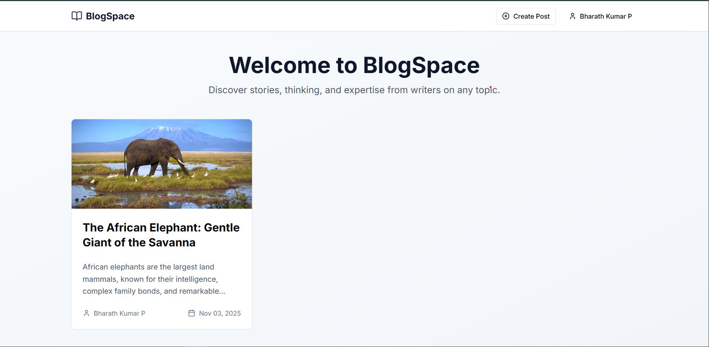
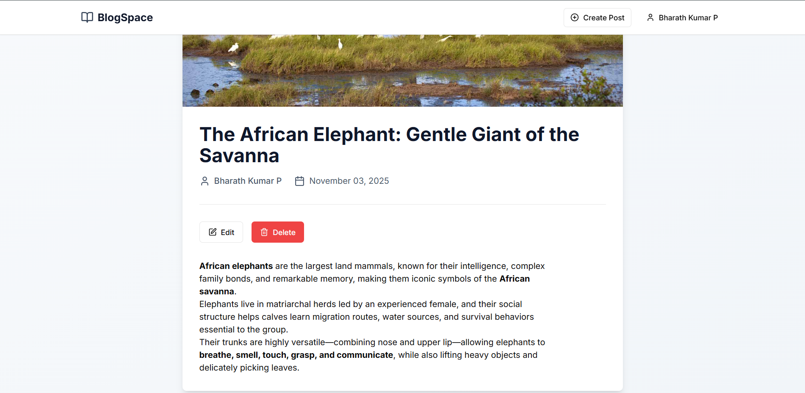

# BlogSpace - Modern Blog Application 🚀

A full-stack blog application built with Next.js 13, TypeScript, Supabase, and modern UI components. Create, read, update, and delete blog posts with rich text editing capabilities.


---

## 🧩 Features

### Core Functionality

- **Full CRUD Operations**: Create, Read, Update, and Delete blog posts
- **Rich Text Editor**: WYSIWYG editor powered by React Quill with formatting options
- **User Authentication**: Secure authentication system using Supabase Auth
- **Responsive Design**: Fully responsive UI that works on all devices
- **Image Support**: Add cover images to blog posts via URL
- **Author Attribution**: Display author name and publish dates
- **Protected Routes**: Only authenticated users can create, edit, or delete posts

### Technical Features

- **TypeScript**: Fully typed codebase for better development experience
- **Server-Side Rendering**: Optimized performance with Next.js 13 App Router
- **Modern UI**: Beautiful components built with ShadCN UI and Tailwind CSS
- **Database**: PostgreSQL database managed by Supabase
- **Row-Level Security**: Secure data access with RLS policies
- **API Routes**: RESTful API endpoints for all CRUD operations

---

## 🛠 Tech Stack

- **Frontend**: Next.js 13 (App Router), React 18, TypeScript
- **Styling**: Tailwind CSS, ShadCN UI
- **Editor**: React Quill (WYSIWYG)
- **Backend**: Next.js API Routes
- **Database**: Supabase (PostgreSQL)
- **Authentication**: Supabase Auth
- **Deployment**: Vercel

---

## ⚙ Project Structure

```
blogspace/
├── app/
│   ├── api/
│   │   └── blogs/
│   │       ├── route.ts          # GET all blogs, POST new blog
│   │       └── [id]/
│   │           └── route.ts      # GET, PUT, DELETE single blog
│   ├── auth/
│   │   ├── login/
│   │   │   └── page.tsx          # Login page
│   │   └── signup/
│   │       └── page.tsx          # Signup page
│   ├── blog/
│   │   └── [id]/
│   │       └── page.tsx          # View single blog
│   ├── create/
│   │   └── page.tsx              # Create new blog
│   ├── edit/
│   │   └── [id]/
│   │       └── page.tsx          # Edit existing blog
│   ├── layout.tsx                # Root layout
│   ├── page.tsx                  # Home page (blog list)
│   └── globals.css               # Global styles
├── components/
│   ├── ui/                       # ShadCN UI components
│   ├── BlogCard.tsx              # Blog card component
│   ├── BlogForm.tsx              # Blog create/edit form
│   ├── Editor.tsx                # WYSIWYG editor wrapper
│   └── Navbar.tsx                # Navigation bar
├── lib/
│   ├── supabase.ts               # Supabase client & types
│   └── auth.ts                   # Authentication helpers
└── README.md
```

---

## 📸 Snapshots

- 
- 

---

## 🕹 Database Schema

### `blogs` Table
- `id` (uuid, primary key) - Unique identifier
- `title` (text, required) - Blog post title
- `content` (text, required) - Rich text content
- `excerpt` (text) - Short preview (auto-generated)
- `image_url` (text) - Cover image URL
- `author_id` (uuid) - References auth.users
- `author_name` (text) - Author display name
- `created_at` (timestamptz) - Creation timestamp
- `updated_at` (timestamptz) - Last update timestamp

### Security (RLS Policies)
- Anyone can read blogs
- Authenticated users can create blogs
- Users can only update/delete their own blogs

---

## 📜 Getting Started

### Prerequisites
- Node.js 18+ and npm
- Supabase account and project

### Installation

1. **Clone the repository**
   ```bash
   git clone https://github.com/imBharathkumarp/BlogSpace.git
   cd BlogSpace
   ```

2. **Install dependencies**
   ```bash
   npm install
   ```

3. **Set up environment variables**

   Create a `.env.local` file in the root directory:
   ```env
   NEXT_PUBLIC_SUPABASE_URL=your_supabase_project_url
   NEXT_PUBLIC_SUPABASE_ANON_KEY=your_supabase_anon_key
   ```

4. **Set up Supabase database**

   The database migration has already been applied. Your Supabase project includes:
   - `blogs` table with proper schema
   - Row-Level Security policies
   - Indexes for optimized queries
   - Automatic timestamp updates

5. **Run the development server**
   ```bash
   npm run dev
   ```

6. **Open your browser**

   Navigate to [http://localhost:3000](http://localhost:3000)

---

## 👀 Usage Guide

### Creating an Account
1. Click "Sign Up" in the navigation bar
2. Enter your name, email, and password
3. You'll be automatically logged in after signup, if not "Sign in" again.

### Creating a Blog Post
1. Log in to your account
2. Click "Create Post" in the navigation
3. Enter a title and content using the rich text editor
4. Optionally add a cover image URL
5. Click "Publish Post" to create your blog

### Editing a Blog Post
1. Navigate to your blog post
2. Click the "Edit" button (only visible for your own posts)
3. Make your changes
4. Click "Update Post" to save

### Deleting a Blog Post
1. Navigate to your blog post
2. Click the "Delete" button (only visible for your own posts)
3. Confirm the deletion

---

## 🦾 API Endpoints

### GET /api/blogs
Fetch all blog posts
- Response: `{ blogs: Blog[] }`

### POST /api/blogs
Create a new blog post
- Body: `{ title, content, excerpt?, image_url?, author_id, author_name }`
- Response: `{ blog: Blog }`

### GET /api/blogs/[id]
Fetch a single blog post
- Response: `{ blog: Blog }`

### PUT /api/blogs/[id]
Update a blog post
- Body: `{ title, content, excerpt?, image_url? }`
- Response: `{ blog: Blog }`

### DELETE /api/blogs/[id]
Delete a blog post
- Response: `{ message: string }`

---

## 💻 Key Implementation Details

### TypeScript Integration
All components and API routes are fully typed with TypeScript for better development experience and fewer runtime errors.

### Authentication Flow
- Uses Supabase Auth for secure user management
- JWT-based session handling
- Protected routes check authentication status
- Automatic redirection for unauthorized access

### WYSIWYG Editor
- React Quill provides rich text editing
- Supports headings, lists, formatting, links, and images
- Custom toolbar configuration
- HTML content storage

### Row-Level Security
- Database-level security using Supabase RLS
- Ensures users can only modify their own content
- Public read access for all blogs
- Authenticated write access with ownership checks

### Responsive Design
- Mobile-first approach
- Breakpoints: sm (640px), md (768px), lg (1024px)
- Flexible grid layouts
- Touch-friendly interface

---

## 👉 Future Enhancements

Potential features to add:
- [ ] Direct image upload to Supabase Storage
- [ ] Comments system
- [ ] Like/favorite functionality
- [ ] Categories and tags
- [ ] Search functionality
- [ ] User profiles
- [ ] Draft/publish status
- [ ] Social sharing buttons
- [ ] Reading time estimation
- [ ] Markdown support option

---

## 🤝 License

MIT License - feel free to use this project for learning or production.

---

## 😊 Author

- GitHub : [imBharathkumarp](https://github.com/imBharathkumarp)
- Built with ❤️ using Next.js, TypeScript, and Supabase

---